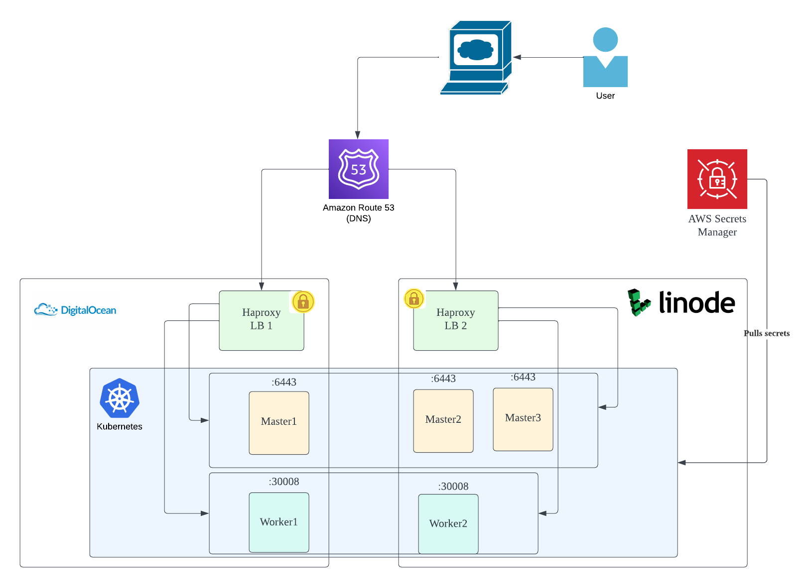

# Steps to spin up a HA Kubernetes cluster

## Develop in a devcontainer

Devcontainer allows you to develop in an isolated container with all required software pre-installed. I strongly recommand setting up devcontainer before you start the subsequent steps. 

<details>
  <summary><i>How to set up a devcontainer?</i></summary>

1. Ensure Docker is installed and running
1. Install [vscode](https://code.visualstudio.com/) and `Dev Containers` extension
1. Open this project in vscode
1. Launch `Command Palette` from the UI or run `⌘ + Shift + P` if you are on Mac
1. Select either `Reopen in Container` or `Rebuild Container` to start the Devcontainer
1. Start terminal in vscode before you run the subsequent steps
</details>


## Create VMs on the cloud



| **Name**              | **Role**      | **Cloud Provider** |
|-----------------------|---------------|--------------------|
| **master1 (primary)** | control plane | DigitalOcean       |
| **master2**           | control plane | DigitalOcean       |
| **master3**           | control plane | Linode             |
| **worker1**           | worker node   | DigitalOcean       |
| **worker2**           | worker node   | Linode             |
| **lb1**                | load balancer | Linode         |
| **lb2**                | load balancer | DigitalOcean          |


<details>
    <summary><i>Run Terraform to Create the VMs</i></summary>

1. Create API token for both Linode and DigitalOcean, and set the following environment variables
    ```
    export TF_VAR_do_token=****************
    export TF_VAR_linode_token=****************
    ```
1. This exercise also assumes that you have a AWS route53 hosted zone. Please create IAM access and set the following environment variables so you can create a DNS record for the loadbalancer IPs:
    ```
    export AWS_ACCESS_KEY_ID=****************
    export AWS_SECRET_ACCESS_KEY=****************
    export AWS_REGION=us-east-1   
    ```

1. Run terraform to create the VMs

    ```
    cd terraform/
    terraform init
    terraform apply
    ```
</details>


## Provision HA cluster using ansible

Update IPs in `ansible/centos/playbooks/env_variables` and `hosts` using the IPs produced by the terraform output

<details>
    <summary><i>Run Ansible to Configure Nodes and Create the Cluster</i></summary>

```
cd ansible/centos/
ansible-playbook --private-key /path/to/private/key setup_cluster.yml
```

</details>

    

## Configure kubeconfig on your machine

Run `./setup_kubeconfig.sh` to copy kube config to `~/.kube` folder so you can interact with the Kubernetes API server.

## Configure Secrets 

1. Create 2 secrets in [AWS Secret Manager](https://aws.amazon.com/secrets-manager/) `us-east-1` region (_Please replace the dummy values with stronger secret_):

    <details><summary><i>n8n-secrets</i></summary>
    
        "DB_POSTGRESDB_PASSWORD": "n8n",
        "N8N_BASIC_AUTH_PASSWORD": "n8n",
        "N8N_ENCRYPTION_KEY": "n8n"
    
    </details>

    <details><summary><i>postgres-secrets</i></summary>

        "PGDATA": "/var/lib/postgresql/data/pgdata",
        "POSTGRES_USER": "n8n",
        "POSTGRES_DB": "n8n",
        "POSTGRES_PASSWORD": "n8n"

    </details>
    
    
1. Create an AWS IAM user with read permissions to both secrets
1. Generate an access key under the IAM user and create a Kubernetes secret to hold the access key. Kubernetes uses access key from this secret to pull external secrets to the cluster.
    ```
    kubectl create namespace n8n
    kubectl create secret generic aws-secret \ 
        --from-literal=access-key-id=<aws_access_key_id> \
        --from-literal=access-key-secret=<aws_secret_access_key> -n n8n
    ```
1. Create two [external-secrets](https://external-secrets.io/) which will be consumed by the application. 
    ```
    # Make sure run the following commands one by one, the order matters!
    ./install_eso.sh
    kubectl apply -f n8n/external-secrets/secret-store.yaml 
    kubectl apply -f n8n/external-secrets/
    ```

## Deploy n8n application

```
kubectl apply -f n8n/
```

## Open the application UI

https://n8n.wu101.com/

